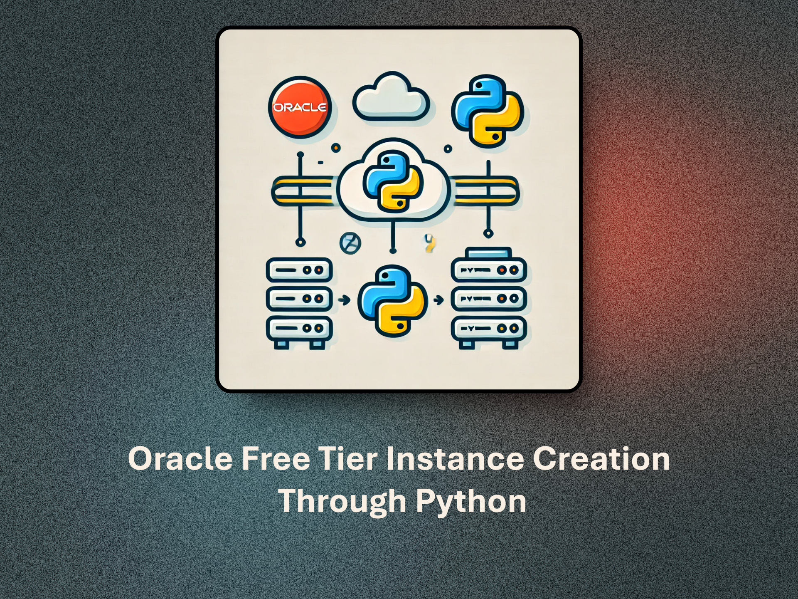
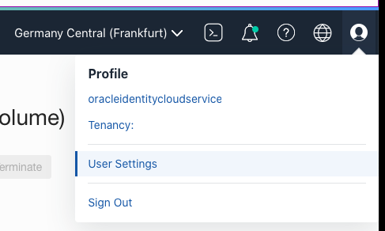
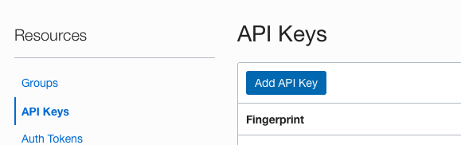
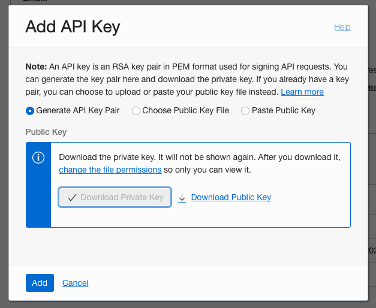
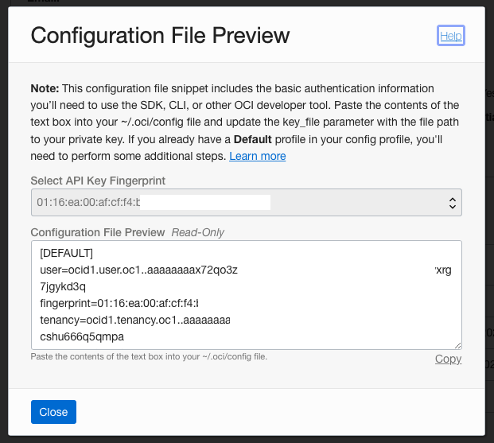
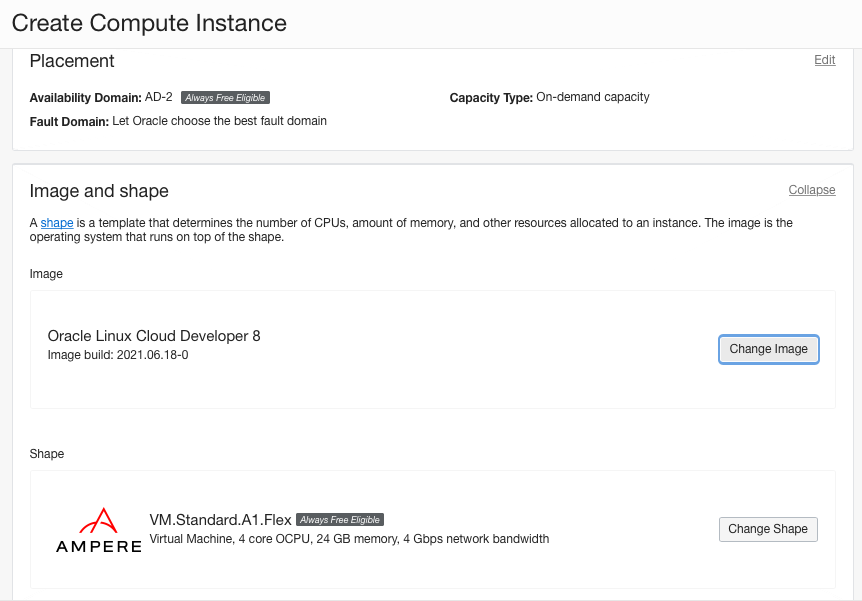
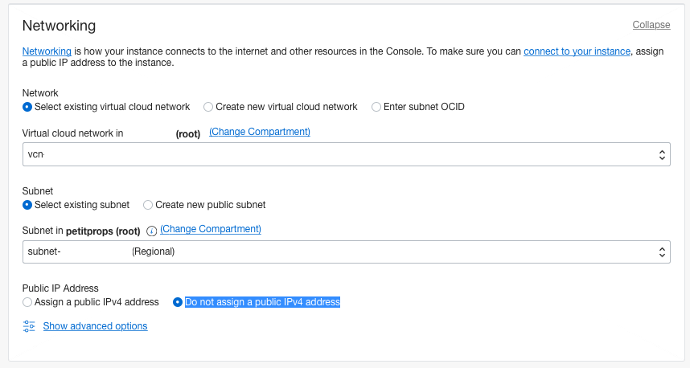
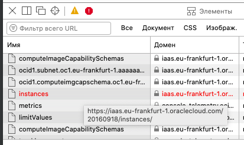

# Oracle Cloud 抢免费 ARM 实例（OCI Free Tier Instance Creation）

用 Python 轮询 OCI LaunchInstance API，自动抢注 Oracle 永久免费（Always Free）的 **Ampere A1 ARM 实例（最高 4 OCPU / 24 GB 内存）** 或 AMD 微型实例（1 OCPU / 1 GB），绕开控制台手动重试的痛苦。

> [!IMPORTANT]
> **开始前必读：[主区域选择](#主区域选择必读)——Oracle 免费层主区域一经注册永久锁定，选错区域无法挽回。**

<p align="center">
    
</p>

## 工作原理

热门区域的免费 ARM 实例长期缺货，手动在控制台反复点创建不现实。本脚本按设定间隔（默认 60 秒）持续调用 OCI 的 `LaunchInstance` API，一旦 Oracle 释放容量即刻抢占：

- 抢到实例后自动停止，并在项目目录生成 `INSTANCE_CREATED` 文件（含实例详情）
- 同时通过已配置的通知渠道（Telegram / 微信 / Discord / 邮件）推送结果
- 支持多可用域（AD）轮换重试、SSH 密钥自动生成、镜像按名称或 OCID 指定


## 主区域选择（必读）

**Oracle Free 永久免费计划无法变更主区域（Home Region）。** 注册时选择的区域即账户主区域，所有 Always Free 资源（AMD 微型实例、Ampere A1 ARM、免费数据库等）**只能在主区域创建和使用**，注册完成后永久锁定，无法更改、迁移或转让（[官方文档](https://docs.oracle.com/en-us/iaas/Content/Identity/Tasks/managingregions.htm)、[Free Tier 说明](https://docs.oracle.com/en-us/iaas/Content/FreeTier/freetier.htm)）。

- 想换主区域，唯一官方途径是**注销当前租户，用新邮箱+新信用卡重新注册**（有被拒风险）
- 升级 Pay As You Go 可解锁其他区域，但**非主区域的资源不享受免费额度，直接扣费**

### 热门免费区域一览（国内用户视角）

| 地区 | 区域 | 特点 |
|---|---|---|
| 🌏 亚太 | 中国香港 | 延迟极低，但长期严重缺货，极难抢到 ARM |
| 🌏 亚太 | 东京 / 大阪 | 速度快、线路稳定，东京缺货常态化 |
| 🌏 亚太 | 新加坡 | 热门，移动/联通线路表现较好 |
| 🌏 亚太 | 首尔 / 春川 | 首尔受欢迎但经常容量不足 |
| 🇺🇸 北美 | 圣何塞 / 凤凰城 | 美西，联通/电信直连尚可，容量相对充足 |
| 🇺🇸 北美 | 阿什本 / 芝加哥 | 美东，延迟高但**容量最充裕，最容易开出 4C24G** |
| 🇪🇺 欧洲 | 法兰克福 / 伦敦 | 欧洲核心节点，常作备选 |

**选区建议**：稳妥拿机器 → 注册即选美东（如 Ashburn）；追求低延迟且愿意长期挂脚本 → 东京/新加坡/首尔。

## 快速开始（Docker，推荐）

```bash
git clone git@github.com:zhengxiongzhao/oracle-arm-freetier.git
cd oracle-arm-freetier
```

1. 在项目根目录放置两个凭证文件（均已 gitignore，不会入库）：
   - `oci_api_private_key.pem` —— OCI API 私钥
   - `oci_config` —— API Key 配置（格式见 `sample_oci_config`，`key_file` 填私钥的**绝对路径**）
2. 编辑 `oci.env` 填写配置（也可运行 `./setup_env.sh` 交互式生成；会自动备份旧文件为 `oci.env.bak`）
3. 启动：

```bash
docker compose up -d
docker logs -f oracle-freetier   # 实时查看抢实例日志
```

容器默认将日志输出到标准输出（`LOG_TO=stdout`），`docker logs` 即可观察；抢到实例后脚本退出，收到通知后手动 `docker compose stop` 即可。

## 裸进程运行（备选）

适合在 OCI 免费微型机（VM.Standard.E2.1.Micro Ubuntu）内运行：

```bash
./setup_init.sh          # 安装依赖并后台启动
./setup_init.sh rerun    # 出错重跑(跳过依赖安装)
```

本地（非 OCI 机器）运行时**必须**在 `oci.env` 里填 `OCI_SUBNET_ID`，否则可能选到非预期子网。

## 配置项（oci.env）

**必填：**

| 变量 | 说明 |
|---|---|
| `OCI_CONFIG` | OCI API 配置文件的绝对路径 |
| `OCT_FREE_AD` | Always Free 可用域（AD），多个用逗号分隔，逐次轮换重试（非并行） |

**可选：**

| 变量 | 默认 | 说明 |
|---|---|---|
| `DISPLAY_NAME` | — | 实例名称 |
| `LOG_TO` | `stdout` | 日志输出目标：`stdout`（标准输出，`docker logs` 直接可见）/ `file`（写 `launch_instance.log` 等文件）/ `both` 两者 |
| `REQUEST_WAIT_TIME_SECS` | `60` | 重试间隔秒数；低于 30 有触发 OCI 限流（`TooManyRequests`）风险 |
| `SSH_AUTHORIZED_KEYS_FILE` | 自动生成 | SSH 公钥绝对路径；文件不存在时自动生成密钥对 |
| `OCI_SUBNET_ID` | — | 已有子网 OCID；**本地运行必填**，在 Micro 实例上运行留空可自动探测 |
| `OCI_IMAGE_ID` | — | 镜像 OCID；留空则按 `OPERATING_SYSTEM`+`OS_VERSION` 选最新镜像，全部可选项写入 `images_list.json` |
| `OCI_COMPUTE_SHAPE` | `VM.Standard.A1.Flex` | 计算形态：`VM.Standard.A1.Flex`（ARM）或 `VM.Standard.E2.1.Micro`（AMD） |
| `SECOND_MICRO_INSTANCE` | `False` | 抢第二台 Always Free 微型实例时设 `True` |
| `OPERATING_SYSTEM` / `OS_VERSION` | — | 按名称选镜像时的系统名与版本 |
| `ASSIGN_PUBLIC_IP` | `false` | 自动分配临时公网 IP |
| `BOOT_VOLUME_SIZE` | `50` | 启动卷大小（GB），低于 50 按 50 处理 |
| `NOTIFY_EMAIL` / `EMAIL` / `EMAIL_PASSWORD` | — | Gmail 通知；开启 2FA 需用应用专用密码 |
| `DISCORD_WEBHOOK` | — | Discord webhook 通知 URL |
| `TELEGRAM_TOKEN` / `TELEGRAM_USER_ID` | — | Telegram 通知 |
| `WECHAT_*`（见下文） | — | 微信 ClawBot 通知 |

### 生成 API 密钥（获取 oci_config 与私钥）

登录 [OCI 控制台](https://cloud.oracle.com)，点击右上角头像 → **User Settings**：



左侧 **API keys** → **Add API Key**：



选 **Generate API Key Pair**，点击 **Download Private Key** 保存 `.pem` 私钥文件，再点 **Add**：



把弹出框中的配置内容复制保存为 `oci_config`（与 `.pem` 私钥放同一目录），并把其中 `key_file` 改为私钥的**绝对路径**：



### 从控制台抓取 Subnet / Image / 可用域

1. 在控制台菜单进入 **Compute → Instances → Create Instance**，选择镜像与形态。AMD 实例需确认可用域带 "Always Free Eligible" 标签（ARM 在主区域内任意 AD 均可）：

    

2. 调整 Networking 部分，勾选 **Do not assign a public IPv4 address**。若无现成 VNIC/子网，可先创建一台 `VM.Standard.E2.1.Micro` 微型实例来生成：

    

3. "Add SSH keys" 部分可跳过（本脚本会自动处理密钥）。**点击 Create 前先打开浏览器开发者工具 → Network 标签**：

    

4. 点击 **Create**（大概率报 "Out of capacity" 错误），在 Network 列表中找到红色的 `/instances` 请求 → 右键 **Copy as cURL**，粘贴到文本编辑器：
   - 从 `data-binary` 参数中找到 `subnetId`、`imageId`、`availabilityDomain` 的值，分别填入 `OCI_SUBNET_ID`、`OCI_IMAGE_ID`、`OCT_FREE_AD`

### SSH 公钥

`SSH_AUTHORIZED_KEYS_FILE` 指向你的公钥文件（如 `~/.ssh/id_rsa.pub`）：

```bash
cat ~/.ssh/id_rsa.pub
# ssh-ed25519 AAAAC3NzaC1lZDI1NTE5AAAAIFwZVQa+F41Jrb4X+p9gFMrrcAqh9ks8ATrcGRitK+R/ user@host
```

文件不存在时脚本会自动生成密钥对；填了路径则直接使用该文件。

## 通知渠道

### Telegram（内置）

```
TELEGRAM_TOKEN=your_telegram_bot_token
TELEGRAM_USER_ID=your_telegram_user_id
```

| 时机 | 内容 |
|---|---|
| 脚本启动 | 🚀 计算形态确认 |
| 抢到实例 | 🎉 完整实例详情（ID / 名称 / AD / 形态 / 状态） |
| 未处理错误 | 😱 错误详情 |

> Bot 无法主动发起会话：运行前先给你的 bot 发一条消息或点 Start，否则通知静默失败。

### 微信 ClawBot（内置，腾讯 iLink 协议）

```
WECHAT_CLAWBOT_TOKEN=your_bot_token        # ClawBot 登录会话 token
WECHAT_CLAWBOT_BASEURL=                     # 可选,默认 https://ilinkai.weixin.qq.com
WECHAT_TO_USER_ID=your_id@im.wechat
WECHAT_CTX_TOKEN=your_context_token
```

微信是双向会话协议而非纯 webhook：

- `WECHAT_CLAWBOT_TOKEN` 来自扫码登录的 ClawBot 会话（官方 `@tencent-weixin/openclaw-weixin` 插件或 weixin-ClawBot-API 客户端登录一次并持久化会话）
- `WECHAT_CTX_TOKEN` 是**入站**消息的上下文 token：需先给 ClawBot 发一条微信消息，bot 记录 `to_user_id` + `context_token` 后本脚本才能推送；会话过期推送会失败，此时再发一条消息刷新 token
- 任一必填键为空时微信通知静默禁用

### Discord / Gmail

`DISCORD_WEBHOOK` 填 webhook URL；邮件通知设 `NOTIFY_EMAIL=True` 并填 Gmail 与应用专用密码。

## 日志

`LOG_TO` 控制输出目标（默认 `stdout`）：

| 模式 | 输出位置 |
|---|---|
| `stdout` | 标准输出（容器 `docker logs` 直接实时可见，compose 已设 `PYTHONUNBUFFERED=1`） |
| `file` | `launch_instance.log`（抢实例 API 调用）+ `setup_and_info.log`（参数详情） |
| `both` | 两者兼有 |

## FAQ

**日志一直刷 "Out of host capacity"，脚本正常吗？**
正常。该错误表示 Oracle 暂时无空闲容量，脚本会按 `REQUEST_WAIT_TIME_SECS` 持续重试，直到容量释放。持续出现这些行恰恰说明脚本在正常工作。

**如何停止脚本？**
Docker：`docker compose stop`。裸进程：`setup_init.sh` 启动时显示的 PID，或 Ctrl+C / `screen -r` 后 Ctrl+C。

**重试太频繁/太慢怎么调？**
改 `REQUEST_WAIT_TIME_SECS`（默认 60 秒）。低于 30 秒易触发 `TooManyRequests` 限流。

**出现 `LimitExceeded` 是已经抢到了吗？**
不一定，表示触发了租户服务限额。登录 [OCI 控制台](https://cloud.oracle.com) 检查是否已有 ARM 实例（有则脚本应自动退出）；也可能与启动卷存储限额相关。

**为什么抢到实例连不上 SSH？**
脚本默认不分配公网 IP（除非 `ASSIGN_PUBLIC_IP=true`），需到控制台手动绑定。更多排障见 [TROUBLESHOOTING.md](TROUBLESHOOTING.md)。

## 参考与致谢

- [hitrov/oci-arm-host-capacity](https://github.com/hitrov/oci-arm-host-capacity) —— 配置与图文指引来源
- [Oracle LaunchInstance API](https://docs.oracle.com/en-us/iaas/api/#/en/iaas/20160918/Instance/LaunchInstance) / [LaunchInstanceDetails](https://docs.oracle.com/en-us/iaas/api/#/en/iaas/20160918/datatypes/LaunchInstanceDetails)
- [Oracle 公共云区域列表](https://www.oracle.com/cloud/public-cloud-regions/) / [Oracle Cloud Free Tier FAQ](https://www.oracle.com/cloud/free/faq/)
- 上游原项目 [mohankumarpaluru/oracle-freetier-instance-creation](https://github.com/mohankumarpaluru/oracle-freetier-instance-creation)
