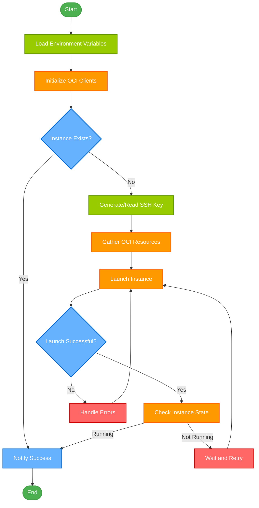

# Oracle Free Tier Instance Creation Through Python

[](https://github.com/mohankumarpaluru/oracle-freetier-instance-creation) [](https://github.com/mohankumarpaluru/oracle-freetier-instance-creation) [](https://github.com/mohankumarpaluru/oracle-freetier-instance-creation) [](https://github.com/mohankumarpaluru/oracle-freetier-instance-creation) [](https://github.com/mohankumarpaluru/oracle-freetier-instance-creation/stargazers)
[](https://github.com/mohankumarpaluru/oracle-freetier-instance-creation/issues) [](https://github.com/mohankumarpaluru/oracle-freetier-instance-creation/network) [](https://github.com/mohankumarpaluru/oracle-freetier-instance-creation/blob/main/LICENSE)


<div style="text-align:center;">
    
</div>


This project provides Python and shell scripts to automate the creation of Oracle Free Tier ARM instances (2 OCPU, 12 GB RAM) or the Oracle Free Tier AMD instance (1 OCPU, 1 GB RAM) with minimal manual intervention. Acquiring resources in certain availability domains can be challenging due to high demand, and repeatedly attempting creation through the Oracle console is impractical. While other methods like OCI CLI and PHP are available (linked at the end), this solution aims to streamline the process by implementing it in Python.

The script attempts to create an instance every 60 seconds or as per the `REQUEST_WAIT_TIME_SECS` variable specified in the `oci.env` file until the instance is successfully created. Upon completion, a file named `INSTANCE_CREATED` is generated in the project directory, containing details about the newly created instance. Additionally, you can configure the script to send a Gmail notification upon instance creation.

**Note: This script doesn't configure a public IP by default; you need to configure it post the creation of the instance from the console. (Planning on automating it soon)**

In short, this script is another way to bypass the "Out of host capacity" or "Out of capacity for shape VM.Standard.A1.Flex" error and create an instance when the resources are freed up.

## Features
- Single file needs to be run after basic setup
- Configurable wait time and DISPLAY_NAME
- Gmail notification
- SSH keys for ARM instances can be automatically created
- OS configuration based on Image ID or OS and version
- Compute shape configuration

## Pre-Requisites
- **VM.Standard.E2.1.Micro Instance**: The script is designed for a Ubuntu environment, and you need an existing subnet ID for ARM instance creation. Create an always-free `VM.Standard.E2.1.Micro` instance with Ubuntu 22.04. This instance can be deleted after the ARM instance creation. (Not required if an existing OCI_SUBNET_ID is defined in oci.env file)
- **OCI API Key (Private Key) & Config Details**: Follow this [Oracle API Key Generation link](https://graph.org/Oracle-API-Key-Generation-12-11) to create the necessary API key and config details.
 - Note: Typically the API Key can be generated from your profile [page](https://cloud.oracle.com/identity/domains/my-profile/api-keys) > API Keys (left) > Add API Key
- **OCI Free Availability Domain**: Identify the eligible always-free tier availability domain during instance creation.
- **Gmail App Passkey (Optional)**: If you want to receive an email notification after instance creation and have two-factor authentication enabled, follow this [Google App's Password Generation link](https://graph.org/Google-App-Passwords-Generation-12-11) to create a custom app and obtain the passkey.

## Setup

1. SSH into the VM.Standard.E2.1.Micro Ubuntu machine, clone this repository, and navigate to the project directory. Change the permissions of `setup_init.sh` to make it executable.
    ```bash
    git clone https://github.com/mohankumarpaluru/oracle-freetier-instance-creation.git
    cd oracle-freetier-instance-creation
    ```

2. Create a file named `oci_api_private_key.pem` and paste the contents of your API private key. The name and path of the file can be anything, but the current user should have read access.

3. Create a file named `oci_config` inside the repository directory. Paste the config details copied during the OCI API key creation. Refer to `sample_oci_config`.

4. In your `oci_config`, fill the **`key_file`** with the absolute path of your `oci_api_private_key.pem`. For example, `/home/ubuntu/oracle-freetier-instance-creation/oci_api_private_key.pem`.

5. Edit the **`oci.env`** file and fill in the necessary details. Refer [below for more information](https://github.com/mohankumarpaluru/oracle-freetier-instance-creation#environment-variables) `oci.env` fields.

	You can also use run the `setup_env.sh` script to interactively generate the `oci.env` file with your desired configuration:

    ```bash
    ./setup_env.sh
    ```

    This script will guide you through the process of configuring your instance settings, including the instance name, compute shape, optional Gmail notifications, and more.

    > [!Note]
    > If an `oci.env` file already exists, the script will create a backup of the current file as `oci.env.bak`.


## Run

Once the setup is complete, run the `setup_init.sh` script from the project directory. This script installs the required dependencies and starts the Python program in the background.
```bash
./setup_init.sh
```
If you are running in a fresh `VM.Standard.E2.1.Micro` instance, you might receive a prompt *Daemons using outdated libraries*. Just click `OK`; that's due to updating the libraries through apt update and won't be asked again.

If you are running in your local instead of `VM.Standard.E2.1.Micro` instance, make sure you fill the `OCI_SUBNET_ID`.

The script will display an error prompt if an issue arises; otherwise, it will show "Script is running successfully."

View the logs of the instance creation API call in `launch_instance.log` and details about the parameters used (availability-domain, compartment-id, subnet-id, image-id) in `setup_and_info.log`.

## Errors and Re-Run

If the `oci_config` file is found to be incorrect, the script generates an `ERROR_IN_CONFIG.log` file. Verify the `oci_config` for accuracy, ensuring it aligns with the [sample_oci_config](https://github.com/mohankumarpaluru/oracle-freetier-instance-creation/blob/85b3ec065a91bb66206933a12a6bd58941446118/sample_oci_config#L1C1-L6C80) without any additional lines or characters.


In case of an unhandled exception leading to script termination, an email containing the logs is sent if opted. Otherwise, only the error logs are printed to `UNHANDLED_ERROR.log`. Review the logs and execute the script again using the following command (which skips dependency installation). If the issue persists, raise an issue with the contents of `UNHANDLED_ERROR.log`.

```bash
./setup_init.sh rerun
```

## OCI Instance Creation Flow



## TODO
- [ ] Ability to run script locally :
	- [x] By letting user configure existing oracle subnet id in `OCI_CONFIG`.
	- [ ] By creating VPC and subnet from Script if running locally (need to handle the free tier limits).
- [ ] Make Boot Volume Size configurable and handle errors and free tier limits.
- [ ] Assign a public IP through the script and handle free tier limits.
- [ ] Make the script interavtive by displaying a list of images and OS that can be used before launching an instance to select.
- [x] Redirect logs to a Telegram Bot.

## Environment Variables
**Required Fields:**

- `OCI_CONFIG`:  Absolute path to the file with OCI API Config Detail content
- `OCT_FREE_AD`: Availability Domain that's eligible for *Always-Free Tier*. If multiple, separate by commas. The script rotates through them on each retry attempt — it does **not** try them in parallel.

**Optional Fields:**
- `DISPLAY_NAME`: Name of the Instance
- `LOG_TO`: 日志输出目标。`stdout`（默认）输出到标准输出（容器运行时可直接 `docker logs` 查看实时抢实例日志）；`file` 仅写入项目目录下的 `setup_and_info.log` / `launch_instance.log`；`both` 两者兼有。容器方式运行默认 `stdout`，docker-compose 已设 `PYTHONUNBUFFERED=1` 确保实时刷新。
- `REQUEST_WAIT_TIME_SECS`: Wait before trying to launch an instance again.
- `SSH_AUTHORIZED_KEYS_FILE`: Give the absolute path of an SSH public key for ARM instance. **The program will create a public and private key pair with the name specified if the key file doesn't exist; otherwise, it uses the one specified**.
- `OCI_SUBNET_ID`: The `OCID` of an existing subnet. **Required when running the script locally** (not on an OCI Micro instance). Leave empty when running on a Micro instance — the script auto-detects the subnet. If left empty while running locally the script may pick an unexpected subnet.
    >  This can be found in `Networking` > `Virtual cloud networks` > `<VPC-Name>` > `Subnet Details`.
- `OCI_IMAGE_ID`: Specific image OCID to use. If left empty, the script uses `OPERATING_SYSTEM` + `OS_VERSION` to find the newest matching image and writes all available options to `images_list.json` on the first run — check that file to find valid image OCIDs.
- `OCI_COMPUTE_SHAPE`: Free-tier compute shape of the instance to launch. Defaults to ARM, but configurable if you are running into capacity issues for the free AMD instance in your home region. Acceptable values `VM.Standard.A1.Flex` and `VM.Standard.E2.1.Micro`.
- `SECOND_MICRO_INSTANCE`: Set to `True` only if you are trying to create your **second** Always-Free Micro instance. If you are running the script to create your first Micro instance (or any ARM instance), keep this `False`.
- `OPERATING_SYSTEM`: Exact name of the operating system
- `OS_VERSION`: Exact version of the operating system
- `ASSIGN_PUBLIC_IP`: Automatically assign an ephemeral public IP address
- `BOOT_VOLUME_SIZE`: Size of boot volume in GB, values below 50 will be ignored and default to 50.
- `NOTIFY_EMAIL`: Make it True if you want to get notified and provide email and password
- `EMAIL`: Only Gmail is allowed, the same email will be used for *FROM* and *TO*
- `EMAIL_PASSWORD`: If two-factor authentication is set, create an App Password and specify it, not the email password. Direct password will work if no two-factor authentication is configured for the email.
- `DISCORD_WEBHOOK`: URL of the Discord webhook for notifications (optional)

## Discord Webhook Notifications

To receive notifications via Discord when an instance is created or when errors occur, you can set up a Discord webhook:

1. In your Discord server, go to Server Settings > Integrations > Webhooks.
2. Click "New Webhook" and configure it for the channel where you want to receive notifications.
3. Copy the webhook URL.
4. Add the following line to your `oci.env` file:

```
DISCORD_WEBHOOK=your_discord_webhook_url_here
```

Replace `your_discord_webhook_url_here` with the actual webhook URL you copied.

When configured, the script will send notifications to the specified Discord channel upon successful instance creation or if any errors occur during the process.


## Telegram Notifications (built into `main.py`)

Besides the shell-wrapper notifications in `setup_init.sh`, `main.py` itself sends Telegram messages directly. Configure in `oci.env`:

```
TELEGRAM_TOKEN=your_telegram_bot_token
TELEGRAM_USER_ID=your_telegram_user_id
```

| Timing | Message |
|---|---|
| Script startup | 🚀 confirmation with the compute shape |
| Instance created | 🎉 full instance details (ID / name / AD / shape / state) |
| Unhandled error | 😱 error details |

> Note: the bot cannot message you first — open a chat with your bot and press Start (or send any message) before running, otherwise delivery will fail silently.


## WeChat ClawBot Notifications (built into `main.py`)

`main.py` can also push notifications to WeChat via Tencent's official **iLink ClawBot protocol** (`ilinkai.weixin.qq.com`). Configure in `oci.env`:

```
# WeChat ClawBot Notification (optional, Tencent iLink protocol)
WECHAT_CLAWBOT_TOKEN=your_bot_token
WECHAT_CLAWBOT_BASEURL=            # optional, defaults to https://ilinkai.weixin.qq.com
WECHAT_TO_USER_ID=your_id@im.wechat
WECHAT_CTX_TOKEN=your_context_token
```

| Timing | Message |
|---|---|
| Script startup | 🚀 confirmation with the compute shape |
| Instance created | 🎉 full instance details (ID / name / AD / shape / state) |
| Unhandled error | 😱 error details |

> ⚠️ **Prerequisites (wechat is a two-sided session protocol, not a pure webhook):**
> - `WECHAT_CLAWBOT_TOKEN` comes from scanning the QR code to log in a ClawBot session — use the official `@tencent-weixin/openclaw-weixin` plugin (or the SiverKing `weixin-ClawBot-API` Python client) once to log in and persist the session.
> - `WECHAT_CTX_TOKEN` is the context token of an **inbound** message: the user must first send a WeChat message to the ClawBot; the bot records `to_user_id` + `context_token`, after which this script can push outbound messages. The token may expire with the session — if delivery stops, send the bot another message and refresh the token.
> - All four keys are stored in `oci.env` (gitignored). If any required key is empty, WeChat notifications are silently disabled.


## Telegram Webhook Notifications

To receive notifications via Telegram when an instance is created or when errors occur, follow these steps to set up Telegram notifications:

### 1. Create a Telegram Bot

1. **Open Telegram** and search for `@BotFather`.
2. **Start a conversation** with `@BotFather` by clicking on it.
3. **Create a new bot** by sending the `/newbot` command.
4. **Follow the prompts** to set the bot's name and username. The username must end with `bot` (e.g., `MyInstanceBot`).
5. After creation, **BotFather will provide a Telegram Bot Token**. **Copy this token**, as you'll need it for configuration.

### 2. Find Your Telegram User ID

1. **Open Telegram** and search for `@myidbot`.
2. **Start a conversation** with `@myidbot` by sending any message (e.g., "Hello").
3. The bot will reply with your **Telegram User ID**. **Note this ID**, as it will be used to direct notifications to your account.

### 3. Configure `oci.env`

Add the following lines to your `oci.env` file to enable Telegram notifications:

```bash
# Telegram Notification (optional)
TELEGRAM_TOKEN=your_telegram_bot_token_here
TELEGRAM_USER_ID=your_telegram_user_id_here
```

## FAQ

**Is the script actually working? The log shows "Out of host capacity" errors.**

Yes — this is completely normal. `Out of host capacity` (or `InternalError: Out of host capacity`) means Oracle doesn't have free capacity right now. The script will keep retrying every `REQUEST_WAIT_TIME_SECS` seconds until capacity opens up. As long as you see these lines in `launch_instance.log`, the script is running correctly.

**How do I stop the script?**

If you launched it with `setup_init.sh`, send SIGINT to the shell session (Ctrl+C) or kill the PID shown after startup. If you used `screen`, re-attach with `screen -r` then Ctrl+C. The background Python process PID is stored in `$SCRIPT_PID` while `setup_init.sh` is running.

**How do I change how often it retries?**

Set `REQUEST_WAIT_TIME_SECS` in `oci.env`. The default is 60 seconds. Setting it too low (e.g., < 30s) risks rate-limiting from OCI (`TooManyRequests` error).

**I see a `LimitExceeded` error — does that mean I already have an instance?**

Not necessarily. It means you have hit a service limit in your tenancy. Log into the [OCI Console](https://cloud.oracle.com) and check whether an ARM instance already exists. If it does, the script should detect it and exit. If not, the limit may relate to boot volume storage — check your tenancy limits.

**For more error-specific help see [TROUBLESHOOTING.md](TROUBLESHOOTING.md).**

## Credits and References
- [xitroff](https://www.reddit.com/user/xitroff/): [Resolving Oracle Cloud Out of Capacity Issue and Getting Free VPS with 4 ARM Cores, 24GB of RAM](https://hitrov.medium.com/resolving-oracle-cloud-out-of-capacity-issue-and-getting-free-vps-with-4-arm-cores-24gb-of-a3d7e6a027a8)
  - [Github Repo](https://github.com/hitrov/oci-arm-host-capacity)
- [Oracle Launch Instance Docs](https://docs.oracle.com/en-us/iaas/api/#/en/iaas/20160918/Instance/LaunchInstance)
- [LaunchInstanceDetails](https://docs.oracle.com/en-us/iaas/api/#/en/iaas/20160918/datatypes/LaunchInstanceDetails)
